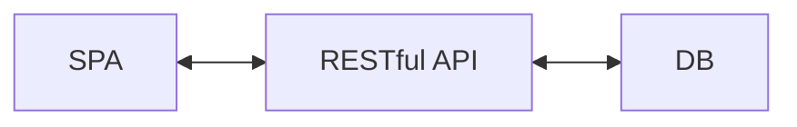
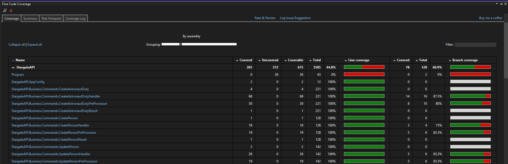
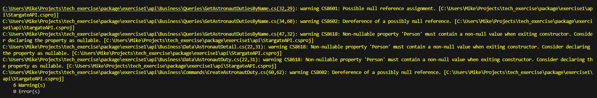

# Stargate - Astronaut Career Tracking System (ACTS)

- [Stargate - Astronaut Career Tracking System (ACTS)](#stargate---astronaut-career-tracking-system-acts)
  - [Overview](#overview)
  - [Dictionary](#dictionary)
  - [Architectural Overview](#architectural-overview)
  - [RESTful API](#restful-api)
    - [Astronaut (Person) Endpoints](#astronaut-person-endpoints)
    - [Astronaut Duty Record Endpoints](#astronaut-duty-record-endpoints)
  - [Single Page Application (SPA)](#single-page-application-spa)
    - [Limitations](#limitations)
  - [Changes](#changes)
  - [Thoughts](#thoughts)
  - [More To Do](#more-to-do)
  - [Unit Test Coverage](#unit-test-coverage)
  - [Compiler Warnings](#compiler-warnings)

## Overview
This application maintains a log of all people that has served as Astronauts along with a history of their duties.

The application consists of a RESTful API and a single page application (SPA). A SQLite database is used for development purposes.

## Dictionary
| Acronym / Term | Definition |
|--|--|
| SPA | Single page application |
| UI | User interface |
| UX | User experience |

## Architectural Overview
The following is a high-level overview of the architecture for this simple application.

## RESTful API
The RESTful API is written using `C# .NET 8.0.303` and has 6 endpoints to service the data creation, modification, and retrieval processes.

### Astronaut (Person) Endpoints
| Method | Endpoint Uri | Purpose |
|--|--|--|
| `GET` | `/Person` | Returns all Astronaut names and current duty records. |
| `GET` | `/Person/{name}` | Retrieve a single Astronaut's current duty record. |
| `POST` | `/Person` | Creates a new Astronaut. |
| `PUT` | `/Person/{name}` | Updates an Astronaut's name. |

### Astronaut Duty Record Endpoints
| Method | Endpoint Uri | Purpose |
|--|--|--|
| `GET` | `/AstronautDuty{name}` | Retrieves all duty records for a single Astronaut. |
| `POST` | `/AstronautDuty` | Creates a new Duty Record for a single Astronaut. |

## Single Page Application (SPA)
The SPA was written using `Angular 18.1.1` and allows the user to add Astronauts and Astronaut Duty records.

### Limitations
The SPA is only supports creating and reading Astronaut data, but no editing Astronaut names. This is the only variance between the functionality offered by the API and SPA.

## Changes
* Added a .gitignore file and ignored the bin and obj folders
* Removed Dapper
* Person name matching was made case insensitive

## Thoughts
The following are thoughts I have about this application and they come from the angle of how I would prefer to do or structure things.

* I'm confused by the requirement for the Astronaut name to be a unique identifier. This was probably done to make the assignment easier. I would refer to Astronauts (inside the system) by their unique ids created by the database. The Astronaut name would also be indexed in the database for increased performance during lookup operations.

## More To Do
There is plenty more work to do on this application to make it production quality. Following is an incomplete list (in no particular order):

* There is no security in the UI or the API layers
  * There is no attempt to implement security in the SPA and no concept of a user account. Typically, a person would be required to login to a system like this.
  * The API is wide open to anyone on the internet. Typically, the API endpoints would be protected and only allow validated users or systems to access them. This can be done with access keys and/or JWT tokens.
* It would be necessary to modify existing data. The API already supports modifying an Astronaut's name, but nothing else. The SPA doesn't support modifying any data.
* There are no indexes or other constraints in the database (aside from primary and foreign key constraints).
* Error handling should be improved in the SPA. Currently, they are simply displayed in alerts or in the browser's developer console. Adding toast notifications and inline error messages would create a better UX.
* There isn't much in the way of logging in the API. The MediatR pipeline transitions are logged to the database, but nothing else is. That would make it more difficult to track down errors in production.

## Unit Test Coverage
The unit testing coverage requirement was met for the API. The screenshot below shows a `60.9%` branch coverage.

## Compiler Warnings
The following compiler warnings existed on the first build before any changes were made:

